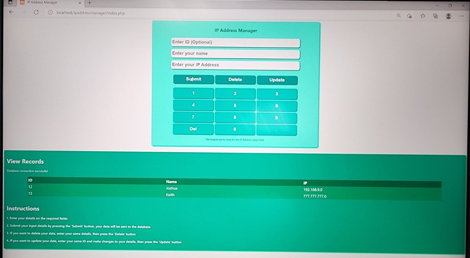
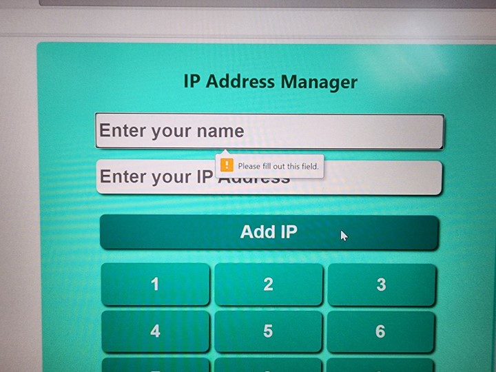
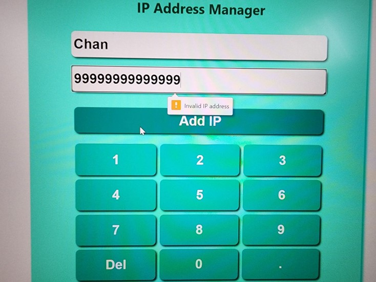
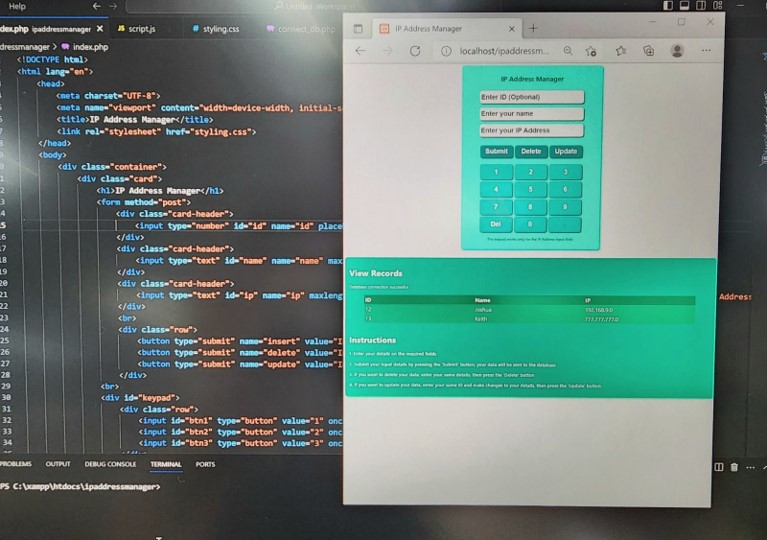
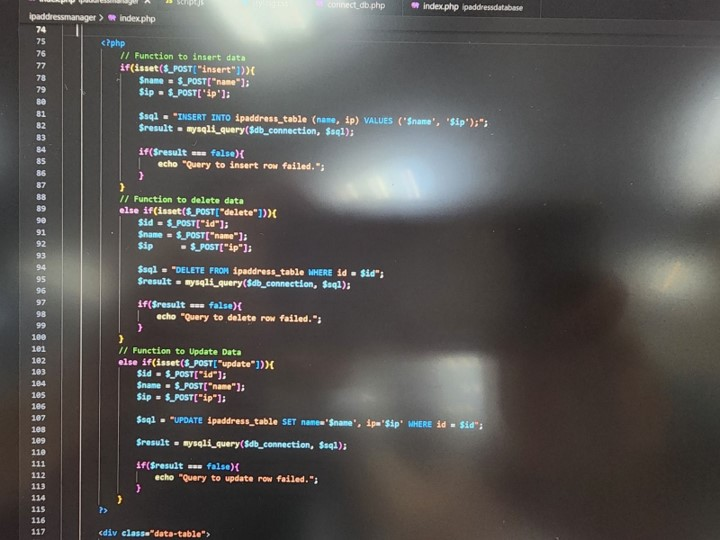

# IP Address Storage Application for Softphone with ST Engineering
### During my ITE internship, I was tasked to create a basic application that can store users' IP addresses for easy IP address management. This project was built using HTML, CSS, PHP, JavaScript and MySQL. Due to the nature of the work, the source code cannot be shared.

    
    
    
    
    

## Technologies Used
* **HTML**: Used to create and design the interface.
* **JavaScript**: Used to perform validation on the form before submission.
* **PHP**: Used to write the backend to perform queries on the database.
* **MySQL**: The database used to store the IP address.
* **CSS**: Used to style and create a responsive interface.

## Some snapshots of my project
### The final interface of the application. It consists of a list of the IP addresses stored and instructions to add new IP addresses.

### Input validation using JavaScript
#### A pop-up validation notification appears after pressing the submit button prompting a user to input the required two fields. (Testing one).

#### A validation notification appears when the user inputs an invalid IP address. (Testing one).

### The application also has the responsive-web design as shown in the minimized tab.
#### When the browser window is scaled down, the website will scale accordingly.

### PHP Backend
#### The part of the PHP code used to retrieve all the data from the MySQL database.

#### The part of the PHP code used for the insert, delete and update functions.

   
  <h1 align="center">Hi There! I'm Joshua! &#128075;</h1>
    

      
  

  
Thank you for taking the time to look through my project! I hope you enjoyed it as much as I did during the development of this project!

  
Feel free to contact me to discuss any issues, questions or comments.

